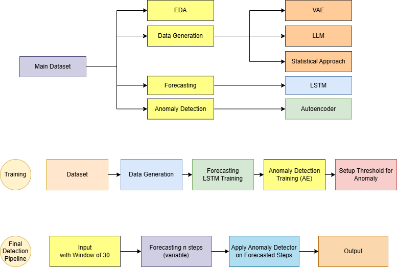
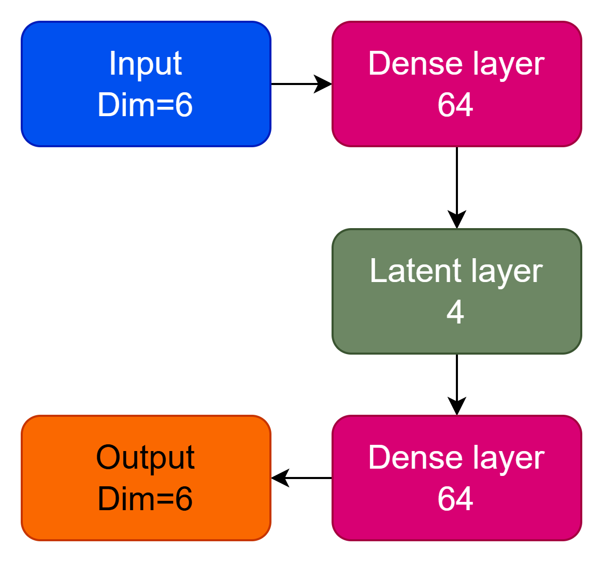
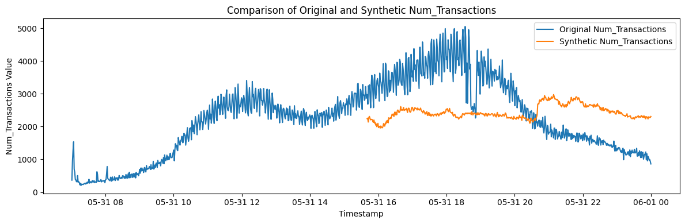
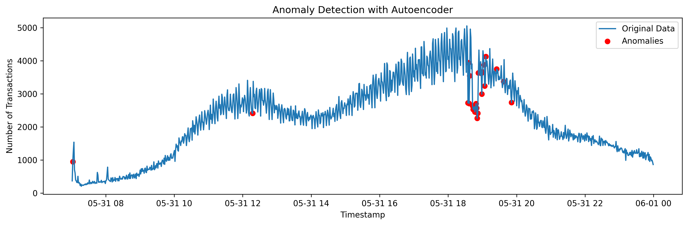
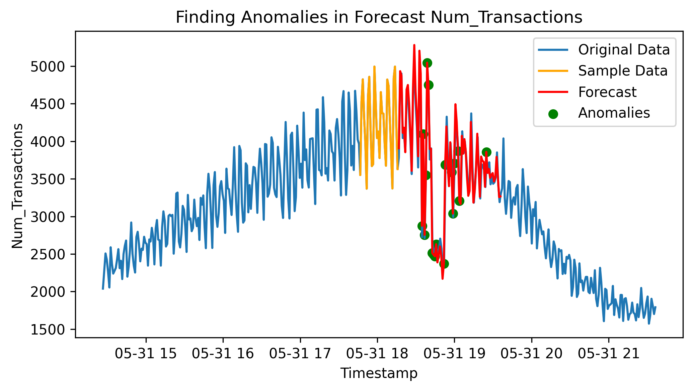
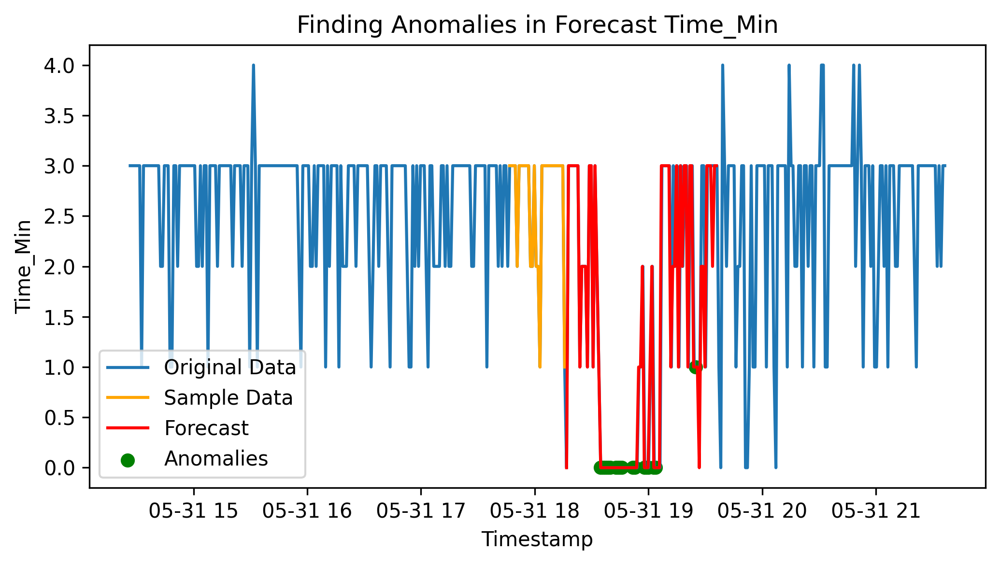
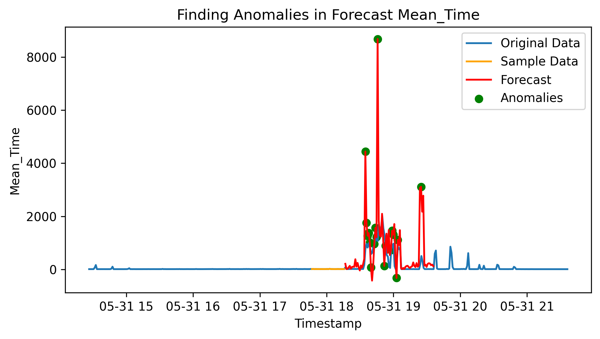
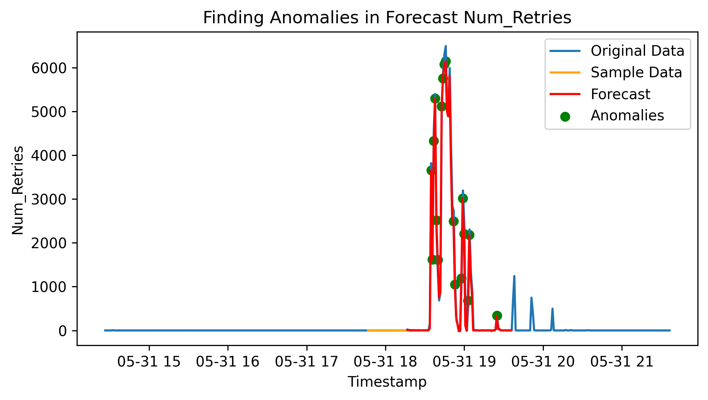
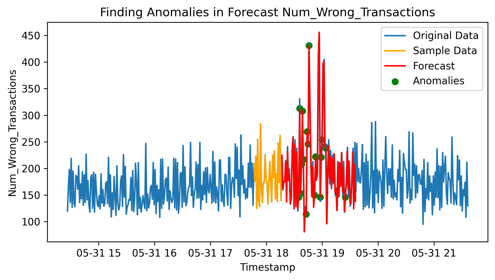

# Title: Needle in haystack - Anomaly Detection with Codeine

Members:
- Shayan Etemadifar
- Mohammad Baghertabarnaghibi
- Sergio Golino 

### Final Pitch: `Final_Pitch_Anomaly_detection.pdf`

# 1. Introduction
### Anomaly Detection

This dataset contains transaction data from a system, recorded over the course of one day. The information is captured in 60-second intervals. For each interval, the dataset includes:

- The number of transactions that occurred

- The minimum, maximum, and average processing time for the transactions

- The number of retries the system performed to successfully process transactions

- The number of failed transactions that were not submitted successfully

Our final goal is to develop an anomaly detection system. This system should be able to take a current time interval, predict transaction behavior in the near future, and apply anomaly detection techniques to the predicted values in order to identify unusual or abnormal transaction patterns.

# 2. Methods – Describe your proposed ideas

### 2.1: Environment
Environment: `python@3.11.11`. We use PyEnv as python version manger and the version of python used can be found in both `.python-version` file and also the `pyproject.toml` file. To manage the packages we use poetry. To install poetry head over to this link: [Installation Guide](https://python-poetry.org/docs/#installation). and then run `poetry install`. You can also use the versions specified in the `pyproject.toml` file for each package and install them manually or with your desired package manager.

### 2.2: Features:
Our final solution includes:
- A function to generate similar data to the real data for several days using statistical approach.
- An LSTM model to predict the future sequence.
- An AutoEncoder model to flag the anomalous records using a reconstruction error threshold.

Here is a quick view of what we did:

### 2.2.1: Data Generation:
We have used VAE model to generate more data but we could not make it generate useful and tuning it was time consuming and hard. You can check the `00 - vae.ipynb` file for that.
We also tried generating data using LLMs locally but we could not generate using large models due to low VRAM. and also small models which would fit in the VRAM would not generate good results. We have tried deepseek R1, Gemma, phi, and others. There is a file in `llm-gen/main.ipynb` for that.
So finally we settled on data generation using statistical approaches by adding noise, sampling from a distribution and randomly changing some data points. We also added some configurations that could be changed to have a more desirable output like varying distributions to use randomly, randomly adding some noises, and these can be found in the code.

### 2.2.2 Forecast using LSTM:
We Used an LSTM, changed number of layers and number of neurons to make the model perform better and we also used a small LR because a large value would make the model to bounce over. We also used a small value for the batch size so that the model would also capture high variances of the sequences at some points. And due to the LR being low we had to go for high number of epochs.
We also added 2 augmented records for each record of train set using randomly generated noises so that the model would not over fit. 

### 2.2.3 Anomaly detection using AE:
We then trained an Auto Encoder model, changed the number of neurons in both hidden layers and also the latent layer and settled for 4 nodes in the latent later.
We also tried training this with augmentation like in the LSTM model but as there was no difference except for different threshold we did not use that.

### 2.2.Extra Specials for LSTM:
Our LSTM model receives a sequence of 30 records as input and produces on future records. Then it takes 29 last records from input and the newly generated one to predict the next value. This way we can predict as many records in the future as we need to without changing the model.

-------------

# 3. Experimental Design – Describe any experiments you conducted to demonstrate/validate the target contribution(s) of your project; indicate the following for each experiment: 
### 3.1 VAE:
#### 3.1.1: What
We Tried VAE for generating the data but the output was not useful because it did not generate data similar to the input and since it was hard to tune, we did not use it.
#### 3.1.2: Why?
Because the generated data did not look like the real data and the variations were not similar.
#### 3.1.3: Metric
Visual comparison with the image you see below:
## 3.1 The main purpose: 1-2 sentence high-level explanation 

### 3.1 LLM:
#### 3.1.1: What
We Tried LLM for generating the data but we lacked hardware.
#### 3.1.2: Why?
It did not work.
#### 3.1.3: Metric
No outputs =((

-----------
# 4. Results

After we did all the previous parts, our model is ready to take a time interval as input, forecast the near future and then apply anomaly detection on the predicted data

We believe a high value in number of transactions is the main reason for being anomaly that could lead to the system’s instability.

The second reason would be a high number of retries and high value for maximum transaction time.

High number of retries and mean time are also involved. Although our model had some prediction errors in Mean Time.

For Minimum time, We could not perfectly understand its nature and relation between a low value with being anomalies.

We believe there is a special meaning behind the value of 0 in minimum time.
 e.g. No complete transaction. Which most probably happens during data aggregation.

 
 
 
 
 
 
--------------
# 5. Conclusion

Conducting these kinds of projects is time-consuming, especially if one is not experienced.
These task also need time and resources (Fast machines to compute, tuning the parameters and the retries).
However, we learned that data generation is a tricky task.

Adding some noise to data makes the forecast more stable.

For future work, we would use LLM for generating data and aslo we would use the variance of features as input
